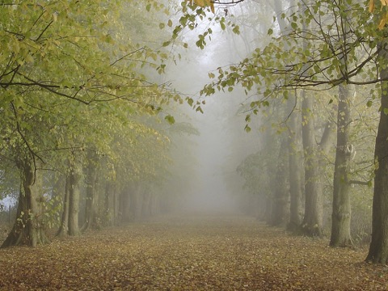
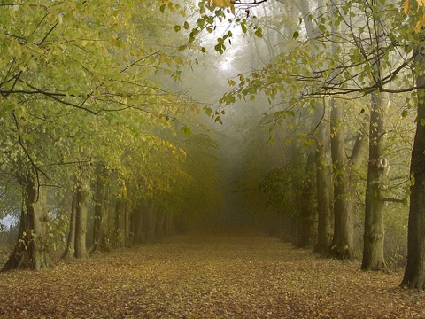

# Defogging of Hazy Images with Filters


Single-image **haze/fog removal** in MATLAB using the **Dark Channel Prior**
algorithm, combined with five different image-enhancement pipelines
(gamma correction, histogram equalization, CLAHE, unsharp masking, Laplacian
sharpening), evaluated quantitatively with **MSE, SSIM, and PSNR**.

 

*Before / after: dark-channel-prior haze removal on a hazy forest scene.*

## What it does

Single-image haze removal using the Dark Channel Prior: estimates a
transmission (haze) map directly from local dark-channel statistics — no
depth sensor, stereo pair, or reference shot needed — and inverts it to
recover the clean scene. Five pre/post-processing combinations (gamma
correction, histogram equalization, CLAHE, sharpening) are layered on top
of the same core algorithm and compared with MSE, SSIM, and PSNR.

## Pipeline

Atmospheric scattering model: `I(x) = J(x)·t(x) + A·(1 − t(x))` — `I` is
the observed hazy image, `J` the haze-free scene, `A` the atmospheric
light, `t` the transmission. Recovering `J` means estimating `A` and `t`,
then inverting the equation:

```
hazy image
    │
    ├─▶ pre-processing (gamma / histeq / CLAHE)      ─┐  varies per
    │                                                  │  pipeline,
    ▼                                                  │  see below
dark channel ─▶ atmospheric light ─▶ transmission map ─▶ guided filter
    │
    ▼
radiance recovery (solve for J, given A and t)
    │
    ├─▶ post-processing (unsharp mask / Laplacian sharpen) ─┘
    ▼
dehazed image ─▶ scored against the original (MSE / SSIM / PSNR)
```

The guided filter refines the raw transmission map to follow actual image
edges instead of looking blocky.

Five pipelines wrap the same core dehazing step (`dehaze_fast`) with
different pre/post-processing, implemented as one parameterized function,
[`pipelines/apply_pipeline.m`](pipelines/apply_pipeline.m):

| # | Pipeline |
|---|---|
| 1 | Gamma correction → DCP → Unsharp masking |
| 2 | Histogram equalization → Laplacian sharpening → DCP |
| 3 | Gamma correction → DCP → Histogram equalization → Unsharp masking |
| 4 | Per-channel CLAHE (RGB + HSV) → Gamma correction → DCP → Unsharp masking |
| 5 | Gamma correction → DCP → Laplacian sharpening |

## Usage

```matlab
addpath('dehazing', 'pipelines');

x = imread('sample_images/1.jpg');
result = apply_pipeline(x, 1);   % method 1-5
imshow(result);

% or run all 5 pipelines over a whole folder and get a scored comparison:
results = run_comparison('sample_images', 'results');
```

`results` is a table of `{Image, Method, MSE, SSIM, PSNR}` — one row per
image/pipeline combination, also written to `results/results.csv`.

> **Note on the metrics:** MSE/SSIM/PSNR are computed against each image's
> own hazy original (no haze-free ground truth exists for this dataset), so
> they measure how much a pipeline changes the image relative to the other
> pipelines — not absolute dehazing accuracy.

Requires MATLAB with the Image Processing Toolbox (`imsharpen`, `histeq`,
`adapthisteq`, `ssim`, `psnr`, `immse`).

## Project layout

```
dehazing/          Dark Channel Prior core algorithm (vendored, MIT)
pipelines/
├── apply_pipeline.m    the 5 enhancement pipelines, parameterized
└── run_comparison.m    batch runner + MSE/SSIM/PSNR scoring
evaluation/         Jupyter notebooks: MSE/SSIM/PSNR plots, results table
sample_images/      16 test images used for the comparison
docs/samples/       before/after demo images
```

## Credits

Core algorithm: [Dark-Channel-Haze-Removal](https://github.com/sjtrny/Dark-Channel-Haze-Removal)
by Stephen Tierney (MIT), implementing:

> K. He, J. Sun, X. Tang. *Single Image Haze Removal Using Dark Channel
> Prior.* IEEE TPAMI, 30(12):2341-2353, 2011.

See [`dehazing/NOTICE.md`](dehazing/NOTICE.md) for details. The five
enhancement pipelines, batch runner, and evaluation are original work.

## License

[MIT](LICENSE) for this project's own code. The vendored core algorithm
under `dehazing/` remains MIT-licensed by its original author — see
`dehazing/LICENSE` and `dehazing/NOTICE.md`.
